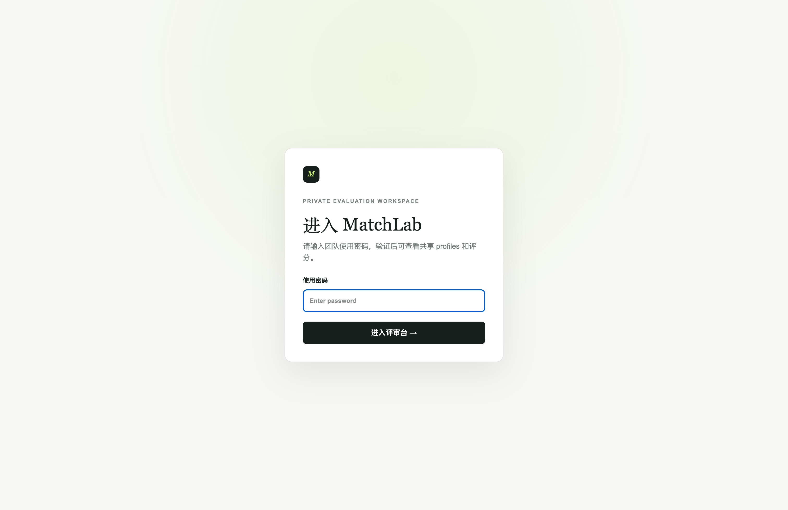
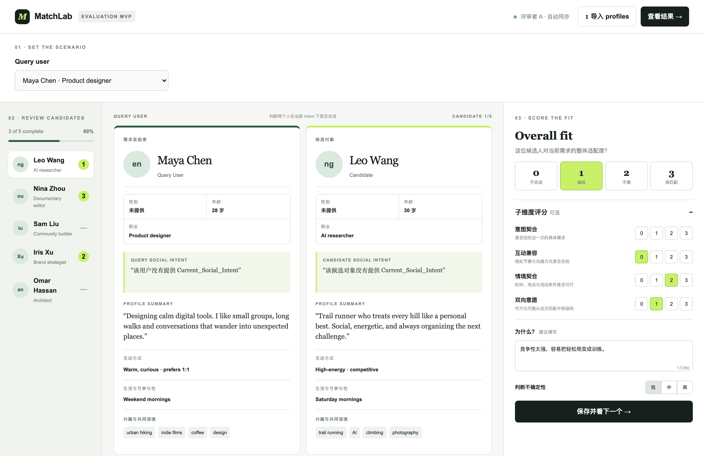
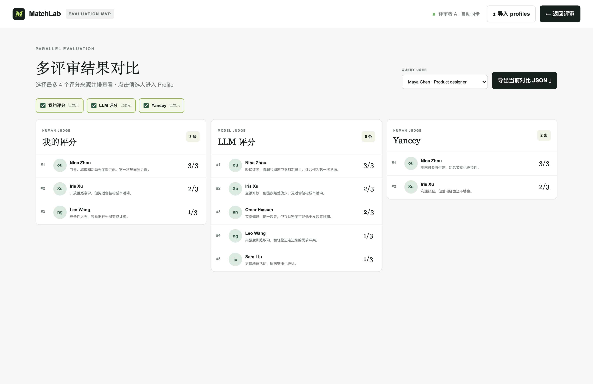
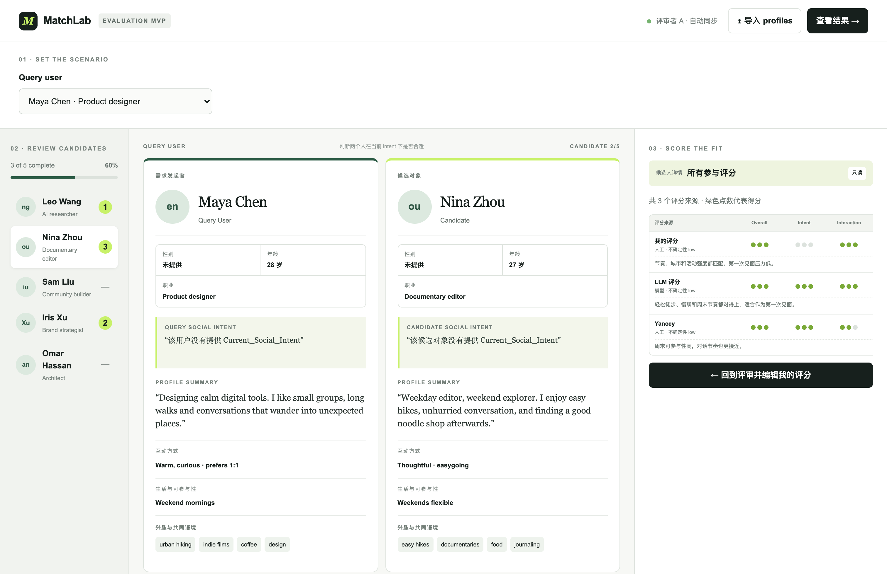

# MatchLab

社交匹配评测工作台。用来回答一件事：**在当前这条社交意图下，该不该把这位候选人推荐给 Query User。**

它不是对外匹配产品，而是给团队做盲评、对齐口径、对照 LLM 排序用的内部评测台。评审者并排阅读两份 profile，按统一量表打分并写下理由；结果页再把「我的评分 / 其他人工评审 / LLM」排在一起，方便看出模型高估、低估或只看兴趣相似度的情况。

## 这个测评在做什么

一次评测固定三件事：

1. **Query User**：需求发起者，带着一条 `Current Social Intent`（例如想找周末轻松爬山、边走边聊的人）。
2. **Candidate**：候选对象。评测只判断这一对在当前意图下是否合适，不给候选人打「绝对好坏」。
3. **统一量表**：Overall 0–3，外加四个可选子维度，以及不确定性。

评测要抓的不是「两个人像不像」，而是这四个问题：

| 维度 | 问的是 |
| --- | --- |
| **意图契合** | 是否回应这一次的具体需求 |
| **互动兼容** | 相处节奏和沟通方式是否合拍 |
| **情境契合** | 时间、地点、活动条件是否可行 |
| **双向意愿** | 对方是否也可能从这次匹配中获益 |

典型用途：导入 Self Layer / MatchLab profile，人工走完一轮候选人，再和 `U01_LLM_Matching_Evaluation.json` 这类 LLM 离线排序对照，找 false positive（兴趣很像但当前不想认识新人）和 false negative。

## 界面说明

### 1. 进入私有评测工作区



工作区有密码门。输入团队密码后，才能看到共享 profiles 和已有评分。登录评审者后，评分会自动同步。

### 2. 评审台：并排读 profile，再打分



评审台是主流程，从左到右三步：

1. **选定 Query User**，系统带出该用户的社交意图。
2. **从左侧队列逐个点开候选人**，中间是发起者和候选人的对照卡（意图、画像摘要、互动方式、可参与性、兴趣）。
3. **右侧打 Overall Fit（0 不合适 / 1 偏弱 / 2 不错 / 3 很匹配）**，必要时补四个子维度、理由和不确定性，然后保存并看下一个。

上图里 Query User 想要轻松徒步聊天，候选人偏高强度训练，所以 Overall 给了 1，理由写的是「竞争性太强，容易把轻松局变成训练」。

### 3. 多评审结果对比



点「查看结果」进入并排对比。最多选 4 个评分来源（自己、LLM、其他评审者），按分数看各自的排序和理由。也可以切换 Query User，或导出当前对比 JSON。

这一页要看的是口径差：同一对候选人，人和模型分别给了几分、理由是否指向同一个风险。

### 4. 回到候选人，看所有来源的分项



在结果页点某个候选人，会回到对照卡，并打开只读的分项矩阵：Overall / Intent / Interaction / Context / Mutuality，以及各来源的理由。需要改自己的分时，再切回编辑。

## 量表

| 分 | 含义 |
| --- | --- |
| 0 | 明显不合适 |
| 1 | 部分符合，但有关键缺口 |
| 2 | 整体可以尝试 |
| 3 | 高度契合 |

不确定性分低 / 中 / 高。证据不足、意图缺失或互相冲突时，应把不确定性打高，而不是硬给高分。

## 本地运行

需要 Node.js `>=22.13.0`。

```bash
npm install
cp .env.example .env
# 在 .env 里设置 MATCHLAB_ACCESS_PASSWORD
npm run dev
```

浏览器打开 `http://localhost:3000/`，输入密码进入。共享评分和 LLM 对照依赖 Sites 的身份头与 D1；本地若未接入登录，页面仍可用内置示例 profiles 走通评审交互。

```bash
npm run build   # 验证构建
npm test        # 构建并检查渲染骨架
```

## 数据

- 点「导入 profiles」可一次导入多份 Self Layer JSON，或带 `profiles` 数组的 MatchLab JSON。
- 仓库里的 `U01_LLM_Matching_Evaluation.json` 是一轮 LLM 离线评测样例：以 U01 为 Query User，按同一套 0–3 量表给全部候选人排序，并写明证据、冲突和局限。
- 结果页导出的 JSON schema 为 `matchlab-parallel-evaluation-v1`。

## 常用命令

- `npm run dev`：本地开发
- `npm run build`：构建
- `npm test`：构建并跑渲染检查
- `npm run db:generate`：schema 变更后生成 Drizzle migration
